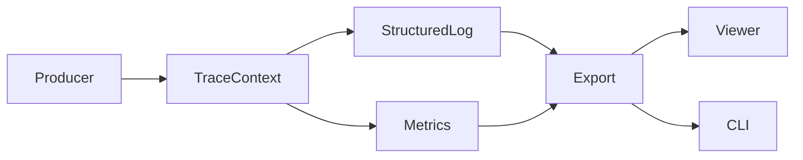

# traceable-ai-observability

[](https://github.com/rafaellimatecnologia-cloud/traceable-ai-observability/actions/workflows/ci.yml)


**Portfolio Note (Safe-to-Publish):** This repository is a clean-room sample intended for public review.

Minimal, deterministic observability primitives for AI/service pipelines: structured logs, metrics
snapshots, and trace correlation with offline-friendly exports.

## Demo (3 seconds)


(add gif after merge)

## Architecture



## Guarantees (Invariants)

- Deterministic identifiers when seeded.
- Stable JSON log schema for parsing and audits.
- Replayable snapshots with JSONL exports.
- No network calls in demos or tests.
- UTF-8 (no BOM) and LF line ending hygiene.

## Quickstart

### macOS/Linux

```bash
python -m pip install -e .
python -m pip install pytest ruff pyright
python examples/demo_cli.py
pytest -q
```

### Windows (PowerShell)

```powershell
python -m pip install -e .
python -m pip install pytest ruff pyright
python examples/demo_cli.py
pytest -q
```

## Development

```bash
python -m pip install -e ".[dev]"
python tools/report_hidden_unicode.py
python tools/sanitize_unicode.py
ruff check .
ruff format --check .
pyright
pytest -q
```

## License

MIT
